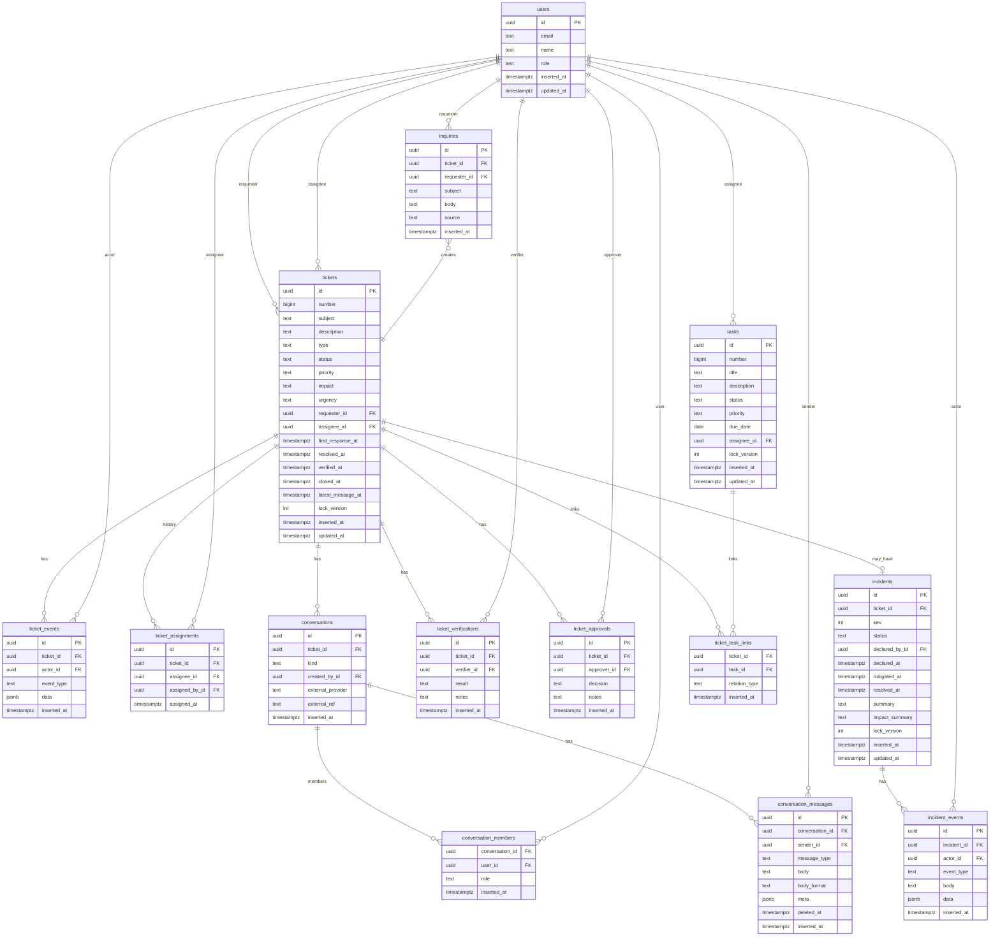

# ERD

以下は DB スキーマ案（`docs/DB_SCHEMA.md`）のER図です（Mermaid）。

補足
- 主キーは uuidv7 を想定（DBでは `uuid_generate_v7()` をデフォルトに設定）。
- `conversations.kind` はMVPで `internal_public` / `internal_private`（2系統）を用意し、将来は `slack/teams/email_thread` 等の外部連携に拡張できます。
- チャット・イベントは `index(parent_id, id)` 前提でページングし、巨大化したらパーティションを検討します。
