# シーケンス図（MVP中心）

本書は Helpdesk Commander の主要ユースケースにおける処理の流れを、Mermaid のシーケンス図で整理する。

前提
- UI: Phoenix LiveView
- ドメイン/データ: Ash Resource（将来実装） + Postgres
- リアルタイム: Phoenix PubSub
- チャット: チケット紐づきの2系統（公開/非公開）
## 0. 会社作成（社内のみ）
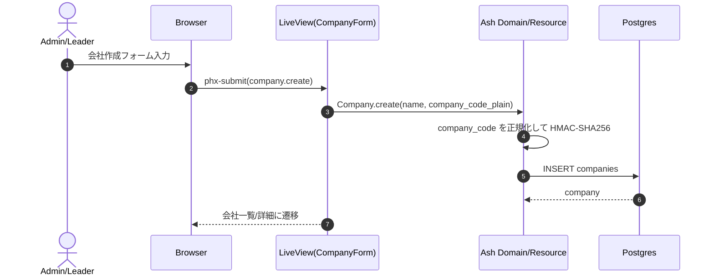

## 0.1 顧客ユーザー仮作成（承認待ち）
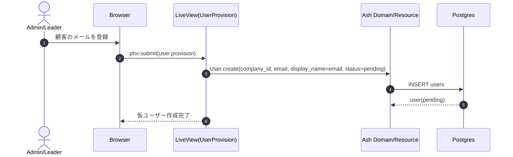

## 0.2 顧客サインアップ（会社ID + login_id/email + パスワード）
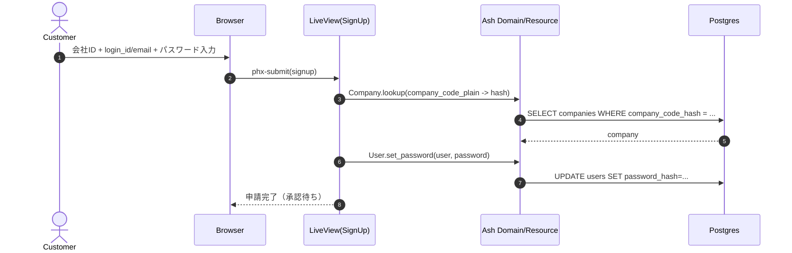

## 0.3 管理者承認 → 有効化
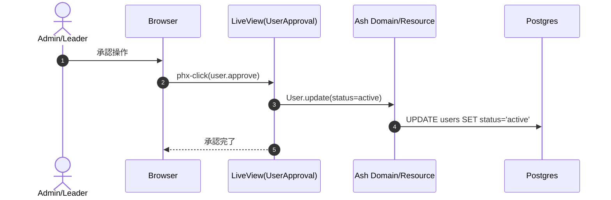

## 0.4 ログイン/ログアウト
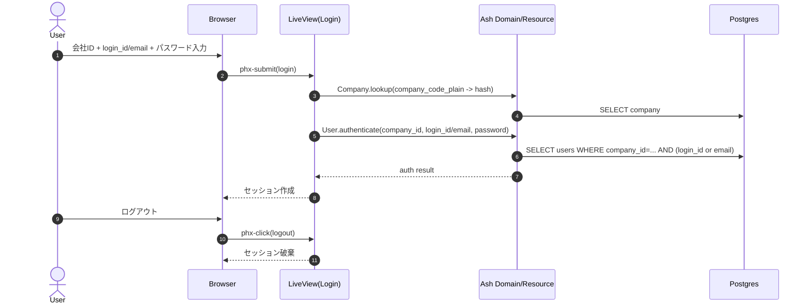

## 1. 問い合わせ作成（ログイン必須）→ Ticket自動生成 → Conversation（公開/非公開）作成
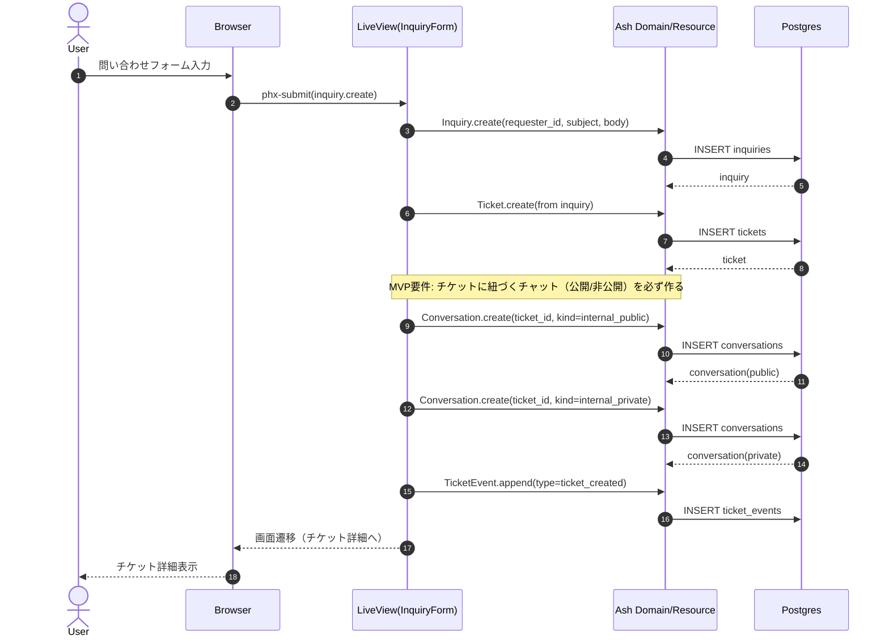

## 2. チケット詳細表示（初期ロード）
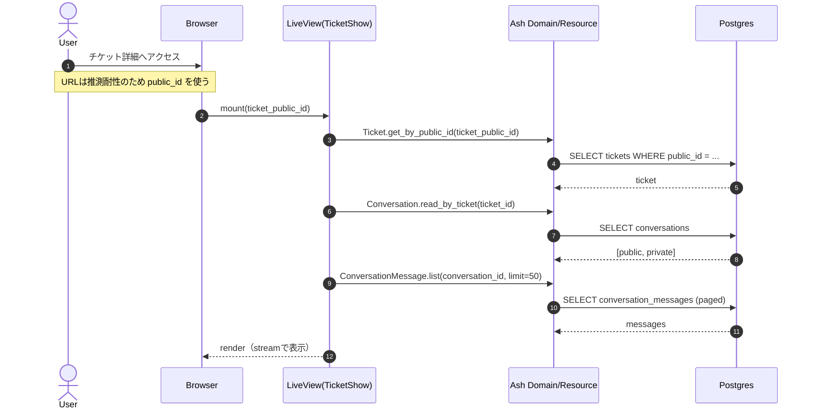

## 3. 公開/非公開チャット投稿（append-only + PubSubでリアルタイム反映）
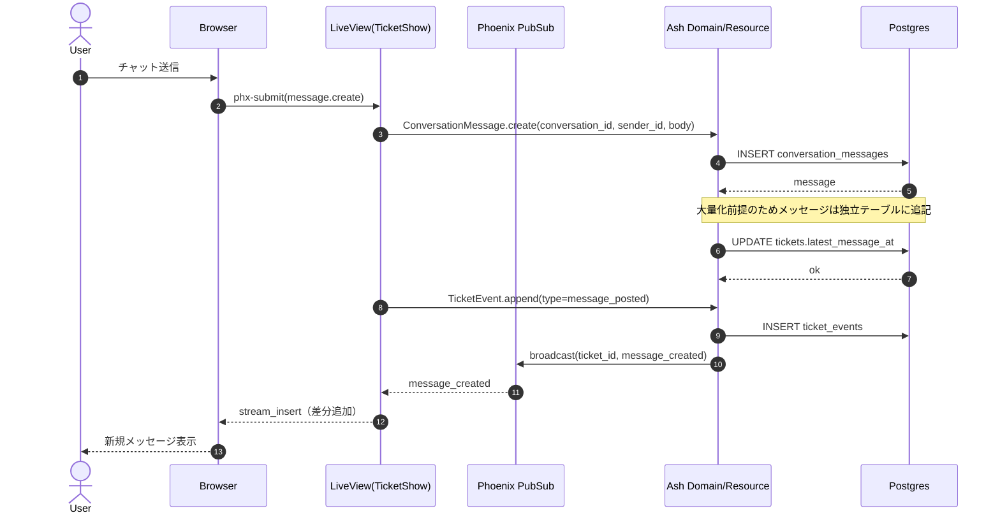

## 4. ステータス更新（競合検知を想定）
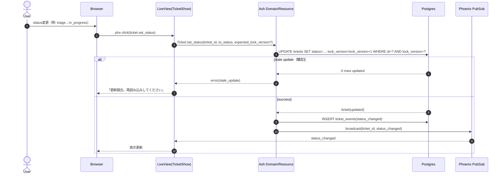

## 5. 対応完了（resolved）→ 検証（一般ユーザー可）→ 最終承認（リーダー/管理者のみ）
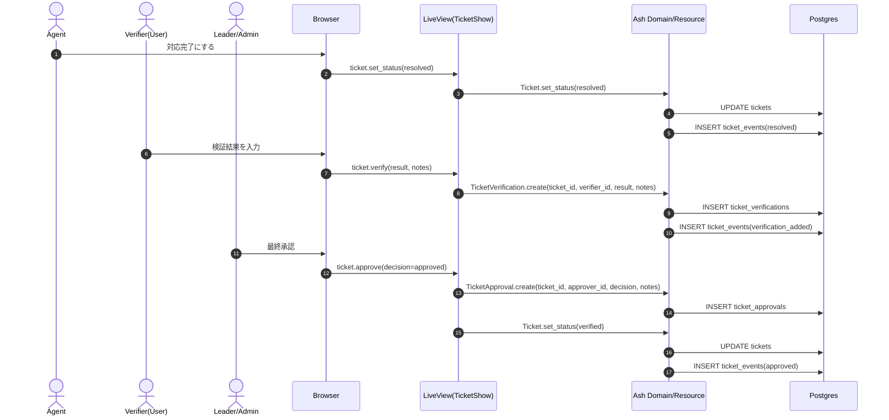

## 6. Ticket → Incident 昇格（リーダー/管理者のみ）
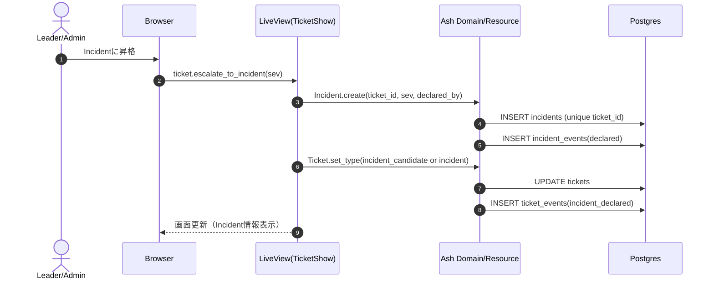

## 7. 過去メッセージのページング（無限スクロール/もっと読む）
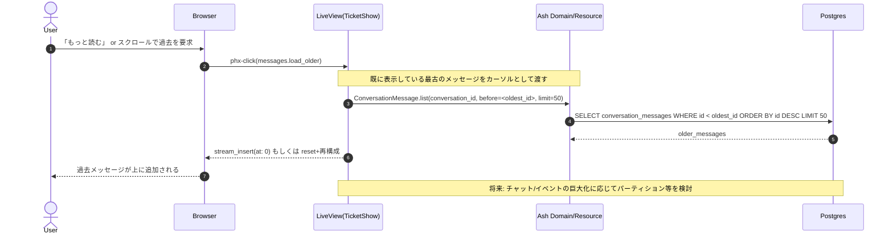

## 8. 通知（アプリ内 → 将来チャット連携）
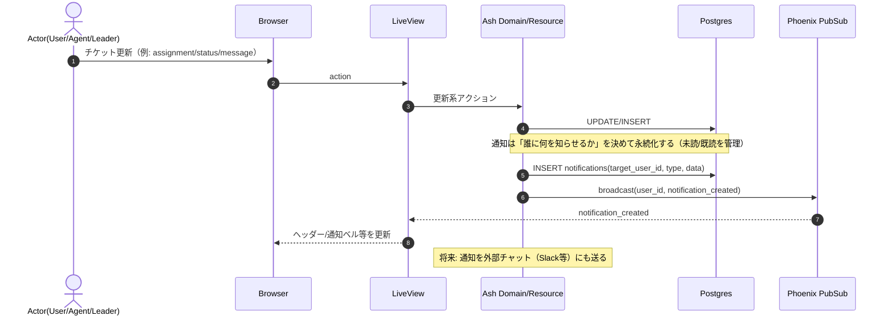

## 9. 監視連携（アラート → Ticket/Incident候補作成）
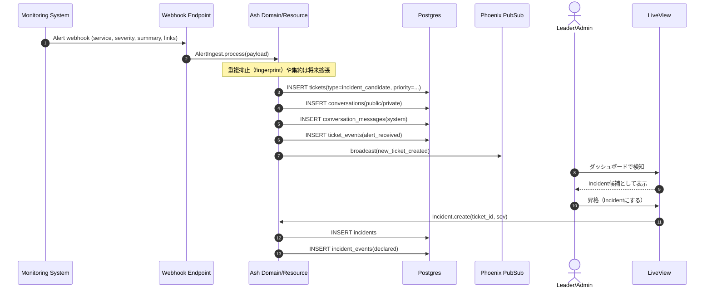

## 10. SSOログイン（OIDC想定）
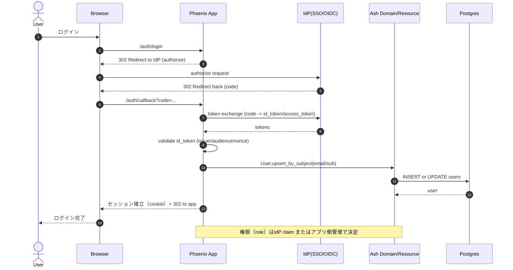

---

必要なら、次を追加できます。
- 添付（チャットメッセージへの添付、ウイルススキャン等）
- 類似チケット提案（重複検知）
- 変更相関（デプロイ/PRとの紐付け）
